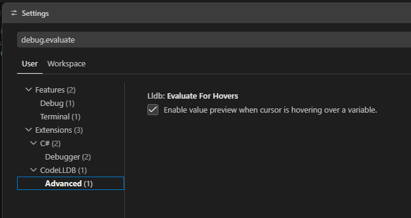

# Visual Studio Code using

## Настройка Build и Run

В Visual Studio Code для Rust есть один безоговорочный стандарт — расширение **rust-analyzer**. Оно не просто подсвечивает синтаксис, а превращает VS Code в полноценную IDE: показывает типы на лету, выводит ошибки компилятора прямо в коде и, самое главное, **автоматически добавляет кнопки запуска и дебага**.

Вот лучшие способы настроить билд и запуск:

### Способ 1: Интерактивные кнопки через `rust-analyzer` (Рекомендуемый)

1. Откройте вкладку **Extensions** (Ctrl+Shift+X) в VS Code.
    
2. Найдите и установите официальное расширение **rust-analyzer** (от _The Rust Project Developers_).
    
3. Откройте ваш файл `src/main.rs`.
    

Вы увидите, что прямо над функцией `fn main()` в самом коде появились маленькие кликабельные надписи: **`▶ Run`** и **`Debug`**.

> 💡 Достаточно просто кликнуть по кнопке **`Run`**, и VS Code сам откроет встроенный терминал, запустит `cargo run` и покажет результат. Это максимально удобно при локальной разработке.

### Способ 2: Настройка горячих клавиш через `tasks.json` (Классический)

Если вы привыкли собирать и запускать проекты по нажатию одной кнопки (например, `Ctrl+Shift+B`), можно настроить стандартные таски VS Code.

1. Нажмите `Ctrl+Shift+P` (палитра команд) и выберите **Tasks: Configure Default Build Task**.
    
2. Выберите **cargo build**. VS Code создаст файл `.vscode/tasks.json`.
    
3. Замените его содержимое на следующий конфиг, чтобы добавить сразу и сборку, и запуск:
    

```json
{
    "version": "2.0.0",
    "tasks": [
        {
            "type": "cargo",
            "command": "build",
            "problemMatcher": [
                "$rustc"
            ],
            "group": {
                "kind": "build",
                "isDefault": true
            },
            "label": "rust: cargo build"
        },
        {
            "type": "cargo",
            "command": "run",
            "problemMatcher": [
                "$rustc"
            ],
            "label": "rust: cargo run"
        }
    ]
```

- Теперь сочетание **`Ctrl+Shift+B`** будет автоматически запускать `cargo build`.
    
- Чтобы запустить проект, можно нажать `Ctrl+P`, ввести `task rust: cargo run` и нажать Enter.
    

## Настройка Debug (F5)

Чтобы работали точки останова (breakpoints) и можно было построчно инспектировать переменные:

1. Установите расширение ==**CodeLLDB**== (оно идеально работает с Rust-бинарниками).
    
2. Нажмите клавишу **`F5`**. VS Code скажет, что конфигурация отсутствует, и предложит создать её автоматически. Нажмите _Yes_ / _Generate_.
    
3. Будет создан файл `.vscode/launch.json`. В 99% случаев расширение само правильно пропишет путь к вашему скомпилированному файлу.
    

После этого вы сможете ставить точки останова слева от номеров строк и запускать проект клавишей `F5` с полноценной отладкой.

Какой вариант вам ближе — кликать по кнопкам `Run` прямо в коде или настроить всё на горячие клавиши?

## Настройка закладки `RUN AND DEBUG`
Для того чтобы эта вкладка ожила, VS Code нужен конфигурационный файл **`launch.json`**. Он объяснит редактору, какой именно бинарник запускать при отладке и какой дебаггер использовать.

Поскольку мы работаем с Rust, лучше всего использовать связку с расширением **CodeLLDB** — оно наиболее корректно отображает типы данных Rust (строки, векторы, структуры) во время остановки на брейкпоинтах.

Вот пошаговый план, как всё настроить за минуту:

### Шаг 1: Установка дебаггера (если ещё не установлен)

1. Перейдите во вкладку **Extensions** (Ctrl+Shift+X).
    
2. Найдите и установите расширение **CodeLLDB** (от автора _Vadim Chugunov_).
    

### Шаг 2: Автоматическое создание `launch.json`

1. Вернитесь на вкладку **Run and Debug** (как на вашем скриншоте).
    
2. Нажмите на синюю ссылку **`create a launch.json file`**.
    
3. В выпадающем списке сверху выберите **LLDB** (или _Cargo Launch_, если предложит расширение Rust).
    

> 💡 **Что произойдет далее:** Расширение поймет, что у вас открыт проект Rust, и автоматически создаст файл `.vscode/launch.json` со всеми нужными настройками.

### Шаг 3: Проверка конфигурации

Сгенерированный файл будет выглядеть примерно так:


```json
{
    "version": "0.2.0",
    "configurations": [
        {
            "type": "lldb",
            "request": "launch",
            "name": "Debug executable 'hello_rust'",
            "cargo": {
                "args": [
                    "build",
                    "--bin=hello_rust"
                ],
                "filter": {
                    "name": "hello_rust",
                    "kind": "bin"
                }
            },
            "args": [],
            "cwd": "${workspaceFolder}"
        }
    ]
}
```

Этот конфиг хорош тем, что перед каждым запуском дебага он сам автоматически дергает `cargo build`, избавляя вас от ручных действий.

### Шаг 4: Поехали! 🚀

1. Откройте `main.rs`.
    
2. Поставьте точку останова (красную точку), кликнув слева от номера строки `2` (там, где у вас `println!`).
    
3. Нажмите клавишу **`F5`** (или зеленую стрелочку `▶`, которая теперь появится на вкладке Run and Debug).
    

Программа соберется, запустится и остановится на вашей строке, а слева во вкладке отобразятся все текущие переменные. На каком из шагов остановимся подробнее?

### Мой `launch.json`

```json
{
    // Use IntelliSense to learn about possible attributes.
    // Hover to view descriptions of existing attributes.
    // For more information, visit: https://go.microsoft.com/fwlink/?linkid=830387
    "version": "0.2.0",
    "configurations": [
        {
            "name": "Debug",
            "type": "lldb",
            "request": "launch",
            "cargo": {
                "args": [
                    "run"
                ]
            },
            "args": []
        },
        {
            "name": "Debug tests",
            "type": "lldb",
            "request": "launch",
            "cargo": {
                "args": [
                    "test"
                ]
            }
        }
    ]
}
```

## Горячие клавиши

### `Ctrl-Shift-B`. Компиляция программы.

Если файл `.vscode\tasks.json` отсутствует - появится меню с командами:
 - cargo build
 - cargo check
 - cargo clippy

если же есть файл с таким содержимым, сразу запуститься компиляция
```json
{
	"version": "2.0.0",
	"tasks": [
		{
			"type": "cargo",
			"command": "build",
			"problemMatcher": [
				"$rustc"
			],
			"group": {
				"kind": "build",
				"isDefault": true
			},
			"label": "rust: cargo build"
		}
	]
}
```


### `F5`. Дебаг программы. 
По факту запускается активный профиль из `launch.json`. Можно установить на закладке `RUN AND DEBUG`

### Ctrl+`F5`. Запуск программы. 
заработало само после настройки F5

## Ошибка падения дебаггера

Если запустить программу в режиме debug и подвести в исходном коде мышку к переменной, которая еще не проинициализирована, то дебаггер свалится. 
Вот решение

- Нажмите **`Ctrl+,`** (или перейдите в _File -> Preferences -> Settings_).    
- В строке поиска вверху введите: **`debug.evaluate`**    
- Найдите пункт **Debug: Evaluate On Hover**.    
- Снимите галочку.

